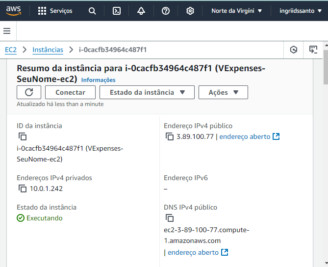
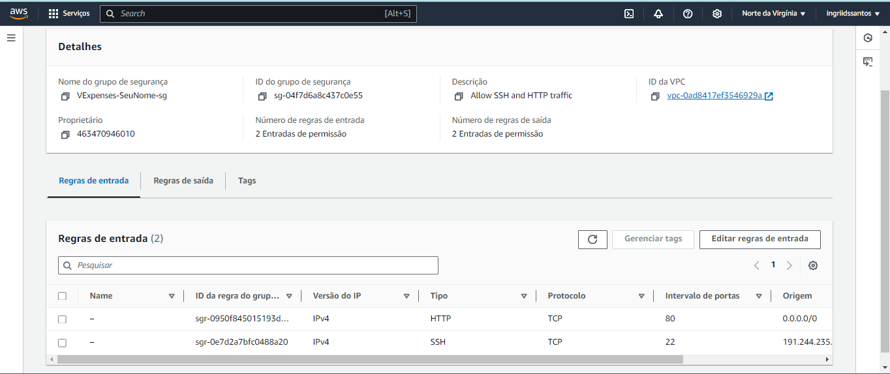
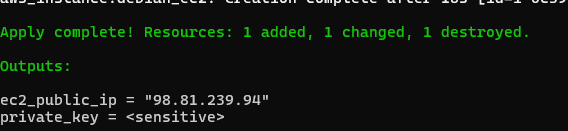
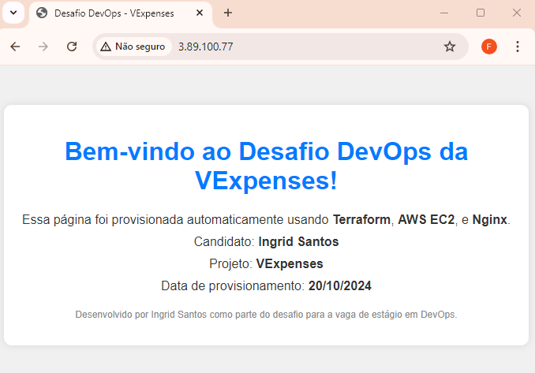

<<<<<<< HEAD
<<<<<<< HEAD
# Projeto DevOps - VExpenses
=======
## Análise Técnica do Código Terraform
>>>>>>> 20298d5e70b148e7f17e063fe0b84ac366477e53

### ○ Leitura do Arquivo
Primeiro, estudei o arquivo `main.tf` fornecido. O código original tinha como objetivo provisionar uma infraestrutura básica na AWS usando o Terraform, criando recursos essenciais para configurar um ambiente seguro e funcional.

### ○ Descrição Técnica
O código `main.tf` realiza as seguintes operações:

<<<<<<< HEAD
- [Análise Técnica do Código Terraform](#análise-técnica-do-código-terraform)
- [Modificação e Melhoria do Código Terraform](#modificação-e-melhoria-do-código-terraform)
- [Instruções de Uso](#instruções-de-uso)
- [Conclusão](#conclusão)
- [Disponibilidade dos Arquivos](#disponibilidade-dos-arquivos)
=======
## Análise Técnica do Código Terraform

### ○ Leitura do Arquivo
Primeiro, estudei o arquivo `main.tf` fornecido. O código original tinha como objetivo provisionar uma infraestrutura básica na AWS usando o Terraform, criando recursos essenciais para configurar um ambiente seguro e funcional.

### ○ Descrição Técnica
O código `main.tf` realiza as seguintes operações:

- **Provider AWS**: Define a região onde os recursos serão provisionados (`us-east-1`).
- **Variáveis**: Contém variáveis para o nome do projeto e do candidato, permitindo personalizar os nomes dos recursos.
- **TLS Private Key**: Gera uma chave privada para ser usada na criação de um par de chaves EC2, permitindo o acesso SSH à instância.
- **VPC e Subnet**: Cria uma VPC (`10.0.0.0/16`) e uma Subnet (`10.0.1.0/24`) associada para isolar a rede.
- **Internet Gateway e Route Table**: Configura um gateway de internet e associa uma tabela de rotas para permitir o tráfego externo.
- **Security Group**: Permite o tráfego SSH e HTTP de qualquer origem.
- **Instância EC2**: Cria uma instância EC2 utilizando uma AMI do Debian 12, do tipo `t2.micro`.
- **Outputs**: Exibe a chave privada gerada e o endereço IP público da instância.




### ○ Observações
- A configuração de segurança permitia tráfego SSH e HTTP de qualquer origem, o que poderia ser melhorado para restringir o acesso.
- A instalação do Nginx não era automatizada, exigindo configuração manual na instância após a criação.

---

## Modificação e Melhoria do Código Terraform

### ○ Aplicação de Melhorias de Segurança
- **Restrição de Acesso SSH**: Modifiquei o código do Security Group para permitir tráfego SSH apenas do meu IP público específico, restringindo o acesso à instância.
  ```hcl
  ingress {
    description = "Allow SSH from my IP"
    from_port   = 22
    to_port     = 22
    protocol    = "tcp"
    cidr_blocks = ["191.57.168.63/32"]
  }




### ○ Pré-requisitos
Para executar este projeto, eu precisei garantir que alguns pré-requisitos estivessem atendidos:
1. **Terraform**: Certifiquei-me de que o Terraform estava instalado em minha máquina local.
2. **AWS CLI**: Configurei o AWS CLI com as credenciais da minha conta AWS.
3. **Chave de Acesso e Secreta da AWS**: Utilizei uma chave de acesso (`Access Key ID`) e uma chave secreta (`Secret Access Key`) para configurar o AWS CLI.

### ○ Configuração do Ambiente

1. **Configuração do AWS CLI**:
   - No terminal, eu executei o seguinte comando para configurar o AWS CLI:
     ```bash
     aws configure
     ```
   - Inserindo as informações solicitadas:
     - **AWS Access Key ID**: Minha chave de acesso.
     - **AWS Secret Access Key**: Minha chave secreta.
     - **Default region name**: `us-east-1`
     - **Default output format**: `json`

     ### ○ Inicializando o Terraform

1. **Inicialização do Terraform**:
   - No diretório do projeto, inicializei o Terraform com o comando:
     ```bash
     terraform init
     ```
   - Esse comando baixou os plugins necessários e configurou o ambiente para o uso do Terraform.

2. **Revisão do Plano de Execução**:
   - Para verificar o plano de execução e os recursos que seriam criados, usei:
     ```bash
     terraform plan
     ```
   - Analisei a saída para confirmar que todos os recursos estavam corretos antes de prosseguir.

3. **Aplicação da Configuração do Terraform**:
   - Para provisionar a infraestrutura, apliquei o plano com:
     ```bash
     terraform apply
     ```
   - Quando solicitado, confirmei a execução digitando "yes". Isso criou os recursos especificados no arquivo `main.tf`, incluindo VPC, Subnet, Security Group, Key Pair e a instância EC2 com o Nginx instalado.

   

### ○ Acesso à Instância EC2

1. **Obtenção do Endereço IP Público**:
   - Depois de executar o `terraform apply`, o Terraform exibiu o endereço IP público da instância EC2. Anotei esse IP para poder acessar a instância.

2. **Conexão à Instância EC2 via SSH**:
   - Para me conectar à instância via SSH, utilizei o seguinte comando, substituindo `<EC2_PUBLIC_IP>` pelo IP público da minha instância:
     ```bash
     ssh -i my-key.pem admin@<EC2_PUBLIC_IP>
     ```

3. **Verificação do Status do Nginx**:
   - Após a conexão, verifiquei se o Nginx estava ativo e em execução com:
     ```bash
     sudo systemctl status nginx
     ```
   - Caso não estivesse rodando, usei o comando para iniciá-lo:
     ```bash
     sudo systemctl start nginx
     ```

### ○ Acessando o Nginx pelo Navegador

1. **Acesso à Página Personalizada**:
   - Abri um navegador web e digitei o IP público da instância EC2 na barra de endereços:
     ```
     http://3.89.100.77/
     ```
   - Isso carregou a página personalizada do Nginx, que eu configurei para exibir as informações do desafio.

   

## Conclusão

Neste desafio de DevOps para a VExpenses, consegui provisionar uma infraestrutura automatizada na AWS usando Terraform, com o objetivo de configurar um ambiente seguro e funcional. Durante o processo, realizei as seguintes atividades:

1. **Análise e melhorias no código Terraform original**: Adicionei melhorias de segurança, como a restrição de acesso SSH para um endereço IP específico, e automatizei a instalação do Nginx usando um script `user_data`, garantindo que o servidor estivesse disponível assim que a instância EC2 fosse provisionada.

2. **Automatização de processos**: O uso do `user_data` para configurar o Nginx automaticamente eliminou a necessidade de configurações manuais pós-criação, reduzindo a margem para erros. A personalização da página inicial do Nginx foi feita para fornecer uma mensagem específica para o desafio, destacando as tecnologias utilizadas e detalhes do projeto.

3. **Configuração de segurança**: A política de segurança foi aprimorada ao restringir o tráfego SSH e garantir que o acesso fosse feito apenas por fontes autorizadas.

4. **Entrega final**: Com a instância EC2 em execução e o Nginx configurado, o projeto foi concluído com sucesso. A página personalizada está disponível para acesso, confirmando que os recursos foram provisionados e configurados corretamente.

## Disponibilidade dos Arquivos

Os arquivos do projeto estão disponíveis no repositório GitHub. Eles incluem:

- `main.tf`: O arquivo Terraform que define toda a infraestrutura, com as melhorias de segurança e automação implementadas.
- `index.nginx-debian.html`: O arquivo HTML personalizado que foi configurado na instância EC2 para exibir a mensagem do desafio.

Para acessar esses arquivos, consulte o repositório [GitHub do projeto](https://github.com/ingriidssantoss/Projeto_DevOps).
>>>>>>> d8db15e (Atualização do arquivo main.tf e README.md)
=======
- **Provider AWS**: Define a região onde os recursos serão provisionados (`us-east-1`).
- **Variáveis**: Contém variáveis para o nome do projeto e do candidato, permitindo personalizar os nomes dos recursos.
- **TLS Private Key**: Gera uma chave privada para ser usada na criação de um par de chaves EC2, permitindo o acesso SSH à instância.
- **VPC e Subnet**: Cria uma VPC (`10.0.0.0/16`) e uma Subnet (`10.0.1.0/24`) associada para isolar a rede.
- **Internet Gateway e Route Table**: Configura um gateway de internet e associa uma tabela de rotas para permitir o tráfego externo.
- **Security Group**: Permite o tráfego SSH e HTTP de qualquer origem.
- **Instância EC2**: Cria uma instância EC2 utilizando uma AMI do Debian 12, do tipo `t2.micro`.
- **Outputs**: Exibe a chave privada gerada e o endereço IP público da instância.


### ○ Observações
- A configuração de segurança permitia tráfego SSH e HTTP de qualquer origem, o que poderia ser melhorado para restringir o acesso.
- A instalação do Nginx não era automatizada, exigindo configuração manual na instância após a criação.

---

## Modificação e Melhoria do Código Terraform

### ○ Aplicação de Melhorias de Segurança
- **Restrição de Acesso SSH**: Modifiquei o código do Security Group para permitir tráfego SSH apenas do meu IP público específico, restringindo o acesso à instância.
  ```hcl
  ingress {
    description = "Allow SSH from my IP"
    from_port   = 22
    to_port     = 22
    protocol    = "tcp"
    cidr_blocks = ["191.57.168.63/32"]
  }


### ○ Pré-requisitos
Para executar este projeto, eu precisei garantir que alguns pré-requisitos estivessem atendidos:
1. **Terraform**: Certifiquei-me de que o Terraform estava instalado em minha máquina local.
2. **AWS CLI**: Configurei o AWS CLI com as credenciais da minha conta AWS.
3. **Chave de Acesso e Secreta da AWS**: Utilizei uma chave de acesso (`Access Key ID`) e uma chave secreta (`Secret Access Key`) para configurar o AWS CLI.

### ○ Configuração do Ambiente

1. **Configuração do AWS CLI**:
   - No terminal, eu executei o seguinte comando para configurar o AWS CLI:
     ```bash
     aws configure
     ```
   - Inserindo as informações solicitadas:
     - **AWS Access Key ID**: Minha chave de acesso.
     - **AWS Secret Access Key**: Minha chave secreta.
     - **Default region name**: `us-east-1`
     - **Default output format**: `json`

     ### ○ Inicializando o Terraform

1. **Inicialização do Terraform**:
   - No diretório do projeto, inicializei o Terraform com o comando:
     ```bash
     terraform init
     ```
   - Esse comando baixou os plugins necessários e configurou o ambiente para o uso do Terraform.

2. **Revisão do Plano de Execução**:
   - Para verificar o plano de execução e os recursos que seriam criados, usei:
     ```bash
     terraform plan
     ```
   - Analisei a saída para confirmar que todos os recursos estavam corretos antes de prosseguir.

3. **Aplicação da Configuração do Terraform**:
   - Para provisionar a infraestrutura, apliquei o plano com:
     ```bash
     terraform apply
     ```
   - Quando solicitado, confirmei a execução digitando "yes". Isso criou os recursos especificados no arquivo `main.tf`, incluindo VPC, Subnet, Security Group, Key Pair e a instância EC2 com o Nginx instalado.

   

### ○ Acesso à Instância EC2

1. **Obtenção do Endereço IP Público**:
   - Depois de executar o `terraform apply`, o Terraform exibiu o endereço IP público da instância EC2. Anotei esse IP para poder acessar a instância.

2. **Conexão à Instância EC2 via SSH**:
   - Para me conectar à instância via SSH, utilizei o seguinte comando, substituindo `<EC2_PUBLIC_IP>` pelo IP público da minha instância:
     ```bash
     ssh -i my-key.pem admin@<EC2_PUBLIC_IP>
     ```

3. **Verificação do Status do Nginx**:
   - Após a conexão, verifiquei se o Nginx estava ativo e em execução com:
     ```bash
     sudo systemctl status nginx
     ```
   - Caso não estivesse rodando, usei o comando para iniciá-lo:
     ```bash
     sudo systemctl start nginx
     ```

### ○ Acessando o Nginx pelo Navegador

1. **Acesso à Página Personalizada**:
   - Abri um navegador web e digitei o IP público da instância EC2 na barra de endereços:
     ```
     http://3.89.100.77/
     ```
   - Isso carregou a página personalizada do Nginx, que eu configurei para exibir as informações do desafio.

   

## Conclusão

Neste desafio de DevOps para a VExpenses, consegui provisionar uma infraestrutura automatizada na AWS usando Terraform, com o objetivo de configurar um ambiente seguro e funcional. Durante o processo, realizei as seguintes atividades:

1. **Análise e melhorias no código Terraform original**: Adicionei melhorias de segurança, como a restrição de acesso SSH para um endereço IP específico, e automatizei a instalação do Nginx usando um script `user_data`, garantindo que o servidor estivesse disponível assim que a instância EC2 fosse provisionada.

2. **Automatização de processos**: O uso do `user_data` para configurar o Nginx automaticamente eliminou a necessidade de configurações manuais pós-criação, reduzindo a margem para erros. A personalização da página inicial do Nginx foi feita para fornecer uma mensagem específica para o desafio, destacando as tecnologias utilizadas e detalhes do projeto.

3. **Configuração de segurança**: A política de segurança foi aprimorada ao restringir o tráfego SSH e garantir que o acesso fosse feito apenas por fontes autorizadas.

4. **Entrega final**: Com a instância EC2 em execução e o Nginx configurado, o projeto foi concluído com sucesso. A página personalizada está disponível para acesso, confirmando que os recursos foram provisionados e configurados corretamente.

## Disponibilidade dos Arquivos

Os arquivos do projeto estão disponíveis no repositório GitHub. Eles incluem:

- `main.tf`: O arquivo Terraform que define toda a infraestrutura, com as melhorias de segurança e automação implementadas.
- `index.nginx-debian.html`: O arquivo HTML personalizado que foi configurado na instância EC2 para exibir a mensagem do desafio.
>>>>>>> 20298d5e70b148e7f17e063fe0b84ac366477e53
